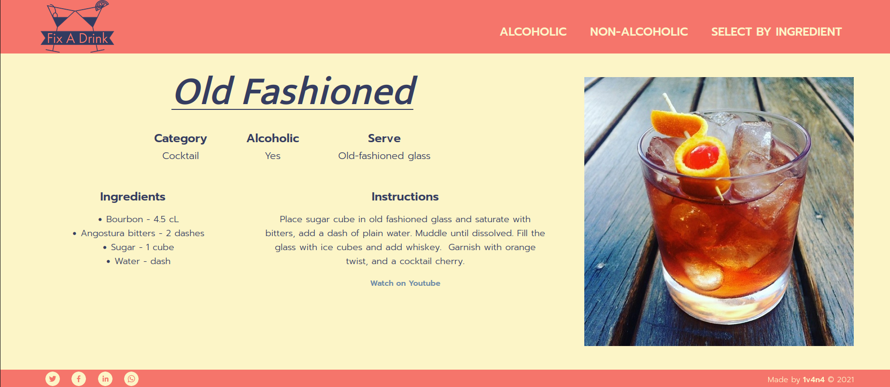
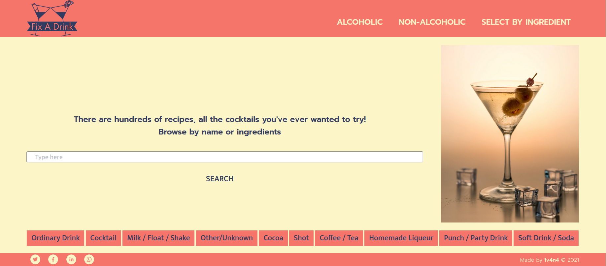

# Fix a drink
This project is a cocktails recipes website with a responsive design that uses The Cocktail Database API (thecocktaildb.com).
Users can get hundreds of od recipes, searching by name or ingredient or using various filters - categories, alphabet, alcoholic, nonalcoholic...

## Built with
- Javascript
- React
- Redux
- HTML
- CSS

## Live link
[Fix a drink](https://fix-a-drink.herokuapp.com/)

## Getting Started

### Prerequisites
- Text editor
- GitHub
- Git
- Node.js
- nmp

### To get a local copy up and running follow these simple example steps:

- Open Terminal.
- Change the current working directory to the location you want the cloned directory.
- Enter `git clone https://github.com/1v4n4/cocktails.git`.
- Press Enter to create your local clone.
- Run cd calculator
- Install dependencies by running `npm install`.

## Available Scripts

In the project directory, you can run:

### `npm start`

Runs the app in the development mode.\
Open [http://localhost:3000](http://localhost:3000) to view it in the browser.

The page will reload if you make edits.\
You will also see any lint errors in the console.

### `npm test`

Launches the test runner in the interactive watch mode.\

### `npm build`

Builds the app for production to the `build` folder.\
It correctly bundles React in production mode and optimizes the build for the best performance.

The build is minified and the filenames include the hashes.\
Your app is ready to be deployed!

### `npm eject`

**Note: this is a one-way operation. Once you `eject`, you can’t go back!**

If you aren’t satisfied with the build tool and configuration choices, you can `eject` at any time. This command will remove the single build dependency from your project.

Instead, it will copy all the configuration files and the transitive dependencies (webpack, Babel, ESLint, etc) right into your project so you have full control over them. All of the commands except `eject` will still work, but they will point to the copied scripts so you can tweak them. At this point you’re on your own.

You don’t have to ever use `eject`. The curated feature set is suitable for small and middle deployments, and you shouldn’t feel obligated to use this feature. However we understand that this tool wouldn’t be useful if you couldn’t customize it when you are ready for it.

## Author
👤 **Ivana Novaković-Leković**

- [Github](https://github.com/1v4n4)
- [Twitter](https://twitter.com/_1v4n4)
- [LinkedIn](https://www.linkedin.com/in/1v4n4/)

## Contributing

Contributions, issues, and feature requests are welcome!

Feel free to check the [issues page](https://github.com/1v4n4/cocktails/issues).

## License
MIT

## Show your support

Give a ⭐️ if you like this project!
